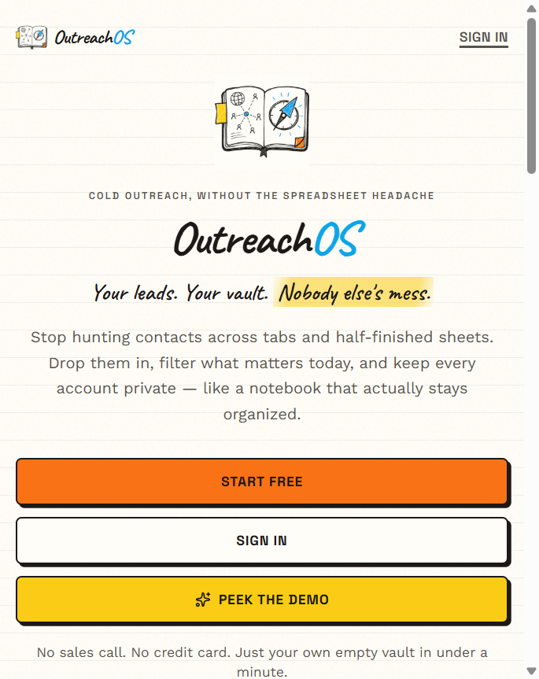
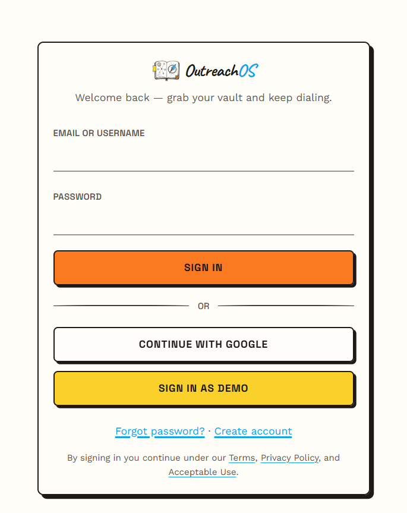
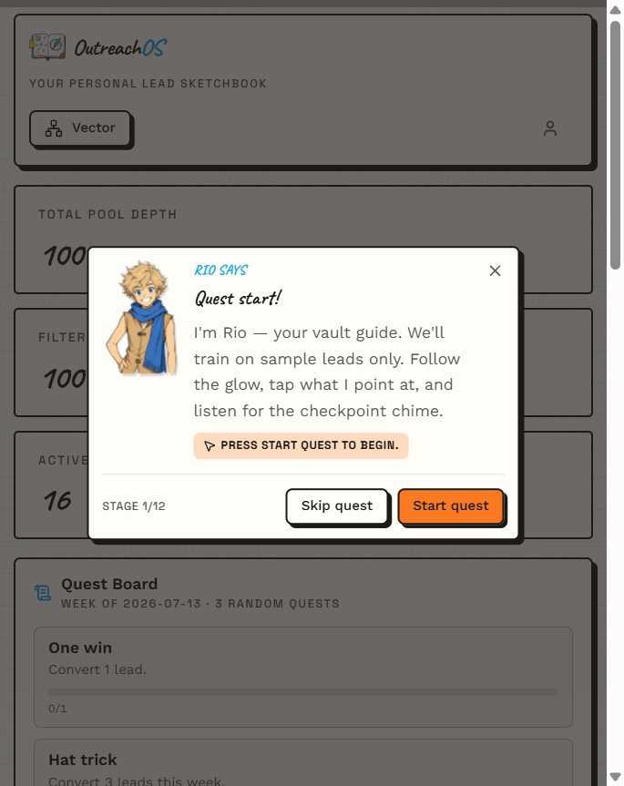
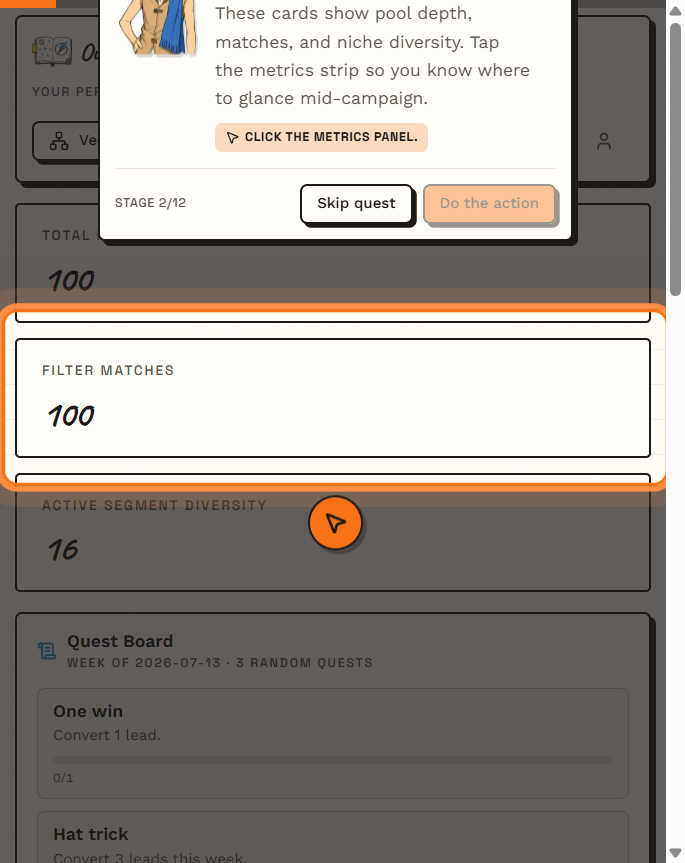
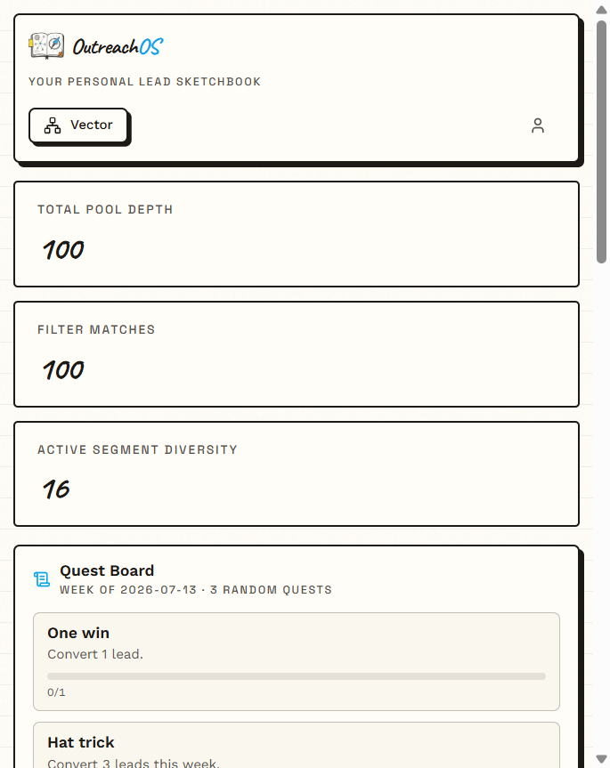
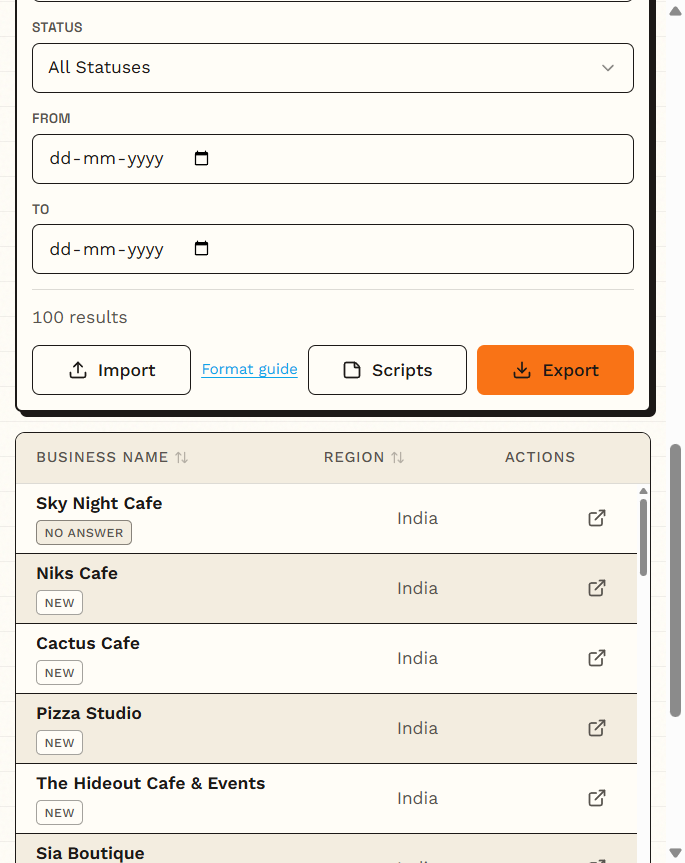
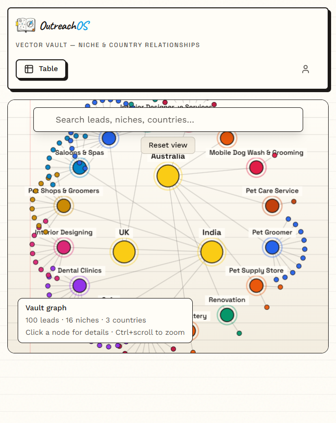
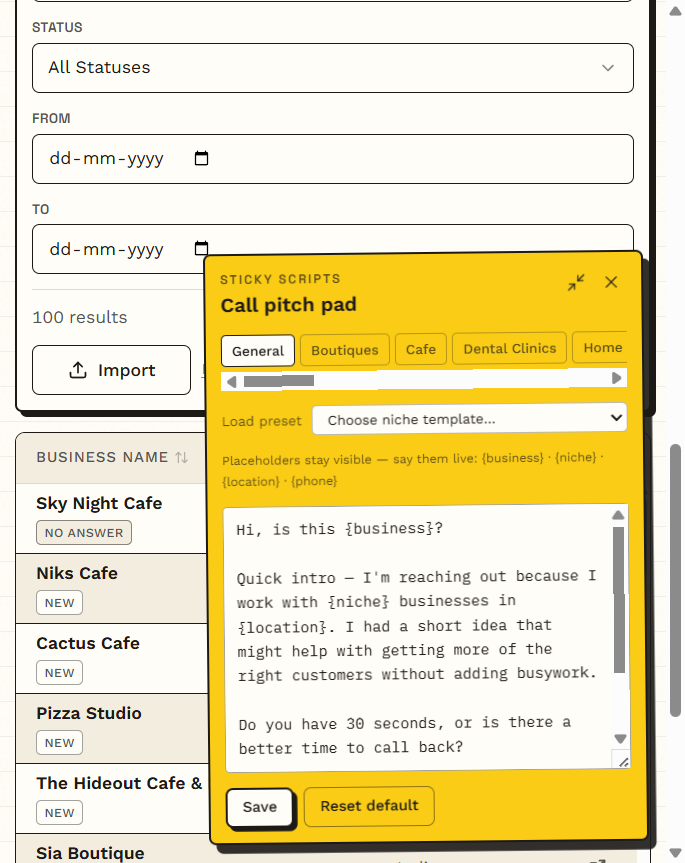

# OutreachOS

Personal lead vault for cold outreach.

I got sick of juggling Excel sheets between niches and countries, so I built this. Dump contacts in, filter what matters today, keep call scripts next to the list, and actually remember who you already rang. Every account gets its own vault — your leads stay yours.

**Live:** [https://outreachos.techxtreme.me](https://outreachos.techxtreme.me)  
**Portfolio:** [techxtreme.me/work/outreachos](https://techxtreme.me/work/outreachos)  
**Repo:** [github.com/its-techxtreme/OutreachOS](https://github.com/its-techxtreme/OutreachOS)  
**Studio:** [techxtreme.me](https://techxtreme.me)  
**Stardance:** [project page](https://stardance.hackclub.com/projects/33617)

<p align="center">
  
</p>

---

## Try it without cloning

1. Open [outreachos.techxtreme.me](https://outreachos.techxtreme.me)
2. Hit **Peek the demo** / **Sign in as Demo** — one click, no password typing

Demo is a shared sample vault (~100 leads). Imports are capped on purpose so people don’t trash it. Want your own empty vault? **Start free** or Google sign-in.

<p align="center">
  
</p>

---

## Demo mode + tutorial

First time you open the demo, **Rio** pops up and walks you through the vault — metrics, filters, scripts, the usual. You can skip whenever. It’s meant to feel like a quick tour, not a lecture.

Demo quirks worth knowing:

- Shared data (don’t expect privacy here)
- Import / write limits so the sample stays usable
- Tutorial only shows once unless you clear it

<p align="center">
  
</p>

<p align="center">
  
</p>

---

## UI (sketchbook on purpose)

Paper texture, doodle borders, sticky notes. I wanted something that feels like a notebook, not another purple SaaS dashboard.

### Dashboard + quests

Metrics up top, optional weekly **Quest Board** (3 random dial goals if you opt in), filters, then the lead table.

<p align="center">
  
</p>

<p align="center">
  
</p>

### Vector vault

Niche / country graph when you want the big picture instead of endless rows.

<p align="center">
  
</p>

### Sticky call scripts

Pitch pad that stays open while you dial. Placeholders like `{business}` / `{niche}` / `{location}` / `{phone}` — you say them live. Drag it around, edit, save your own. General + niche scripts.

<p align="center">
  
</p>

---

## Auth

Pretty normal stuff, just wired carefully:

| Path | What it does |
| --- | --- |
| Email + password | Signup → verify email → pick a username |
| Google | One-tap sign-in (same account if emails match + Automatic Linking is on) |
| Demo | Shared sample vault, no password typing |
| MFA | Optional TOTP in settings (secrets encrypted at rest) |
| Admin | Google + allowlisted email only → `/admin/management-dashboard` |

Password reset, username claim, and account delete live under `/auth/*` and settings. User passwords go through **Supabase Auth** — we don’t store them ourselves.

---

## What’s in the app

- Excel import + format guide (`/import-guide`) + template under `public/templates/`
- Filters, search, CSV export
- Call statuses: New, Called, No Answer, Callback, Replied, Converted, Archived
- Sticky scripts (general + niche), draggable
- Optional Quest Board
- Vector vault graph
- Per-user lead pools (owner isolation)
- Free vs **Premium** on `/pricing` — ₹1499 or $15 / month; request by email, I grant from the admin dashboard after payment
- Public SEO bits: sitemap, robots, `llms.txt`

Still has a leftover agent POST at `/api/agent/leads` from an early ChatGPT experiment — **not a v1 product feature**. Code stays as a foundation if we ship GPT agent intake in v2. Use Excel import today.

---

## Stack

Next.js · Supabase (Auth + Postgres) · Tailwind · Vercel

```text
Excel import  →  Next.js API  →  Supabase
                     ↓
           Dashboard (filter / dial / export)
```

---

## Local setup

Need Node 18+, a Supabase project, and a little patience with env vars.

```bash
git clone https://github.com/its-techxtreme/OutreachOS.git
cd OutreachOS
npm install
cp .env.example .env.local
```

Fill `.env.local` from `.env.example`. Important ones:

- `NEXT_PUBLIC_SUPABASE_URL` / `NEXT_PUBLIC_SUPABASE_ANON_KEY`
- `SUPABASE_SERVICE_ROLE_KEY` (server only)
- `AGENT_SECRET` (only if you ever poke the legacy agent route; optional for normal use)
- `ENCRYPTION_KEY` (64 hex chars — MFA secrets at rest)
- `ADMIN_*` / `ADMIN_GOOGLE_EMAIL` and optional `DEMO_USER_*`
- `NEXT_PUBLIC_APP_URL` / `NEXT_PUBLIC_SITE_URL` (prod: `https://outreachos.techxtreme.me`)

Run migrations in `supabase/migrations/` in order (through `009_subscriptions.sql`), then:

```bash
npm run ensure:accounts
npm run seed:demo
npm run dev
```

Open [http://localhost:3000](http://localhost:3000).

### Supabase Auth checklist

- Redirect URLs: `/auth/callback`, `/auth/login`, `/auth/reset-password`, `/auth/username`
- Turn on **Automatic Linking** for verified emails so Google + password stay one user
- If you already duplicated an admin as Google-only:

```bash
node --env-file=.env.local scripts/merge-auth-identities.mjs --dry-run
node --env-file=.env.local scripts/merge-auth-identities.mjs --email=you@example.com
```

Admin console: `/admin/management-dashboard`

---

## Scripts

```bash
npm run dev
npm run build
npm run test
npm run test:e2e
npm run lint
npm run ensure:accounts
npm run seed:demo
npm run audit:secrets
```

---

## Docs

| Doc | What’s in it |
| --- | --- |
| [API Spec](./docs/API_SPECIFICATION.md) | Legacy agent endpoint (retired) |
| [Deployment](./docs/DEPLOYMENT_GUIDE.md) | Vercel / prod notes |
| [SEO / Search Console](./docs/SEO_SEARCH_CONSOLE.md) | Getting indexed on Google |
| [Security](./docs/SECURITY_REQUIREMENTS.md) | Auth + secrets expectations |
| [Architecture](./docs/TECHNICAL_ARCHITECTURE.md) | How pieces fit |
| [Custom GPT](./docs/chatgpt/CUSTOM_GPT_INSTRUCTIONS.md) | Parked for v2 — not a v1 product feature |
| [PRD](./docs/PRODUCT_REQUIREMENTS_DOCUMENT.md) | Early planning notes (product moved on since) |
| [Accessibility](/accessibility) | Accessibility notice |

Screenshots in this README are from the live site (`docs/readme/`).

---

## Security (short version)

Don’t commit `.env.local` or real keys. Service role stays server-side. Passwords go through Supabase Auth. MFA secrets are encrypted with `ENCRYPTION_KEY`. Demo is intentionally limited. Keep `npm audit` clean when you bump deps.

---

## Credits

Built by **Athan** ([Techxtreme](https://techxtreme.me)).

I use [Cursor](https://cursor.com) a lot while coding — autocomplete, refactors, tests, and the dull glue. Product direction, design calls, and final review are mine. If something feels off in production, blame me, not the editor.
